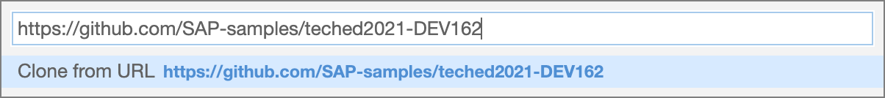
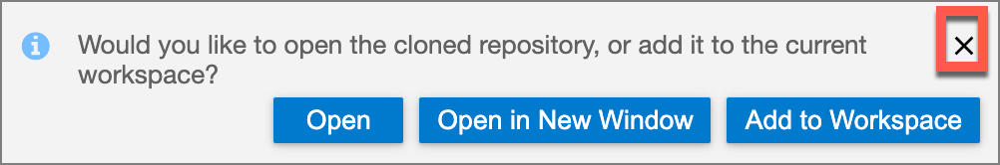

# Getting Started - Clone the TechEd session repository

Before starting on the session exercieses, we will first clone the session git repository into the Business Application Studio workspace.

1. From the Welcome page select `Clone from Git`

    

1. In the `Provide repository URL` field, paste the URL (https://github.com/SAP-samples/teched2021-DEV162) to the session repository and press **Enter**.

    

1. When the clone is completed, click the X to close the notification popup.

    

## Summary

You've now cloned the repository for this session.

Continue to - [Exercise 1 - Create an application from the MDK template](exercises/ex1/README.md)