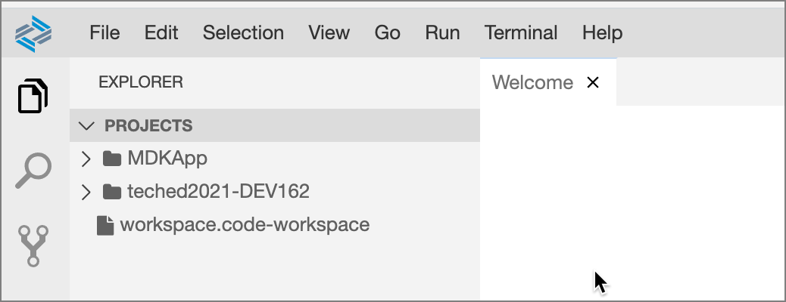

# Exercise 1 - Create an application from the MDK template

In this exercise, you will create an MDK application from a template.  

- [Exercise 1.1 - Create the MDKApp project from a template](#exercise-11---create-the-mdkapp-project-from-a-template)
- [Exercise 1.2 - Change the workspace to the projects folder](#exercise-12---change-the-workspace-to-the-projects-folder)

### Exercise 1.1 - Create the MDKApp project from a template

1. Create the starting MDK application for this session the following link:

    https://developers.sap.com/tutorials/cp-mobile-dev-kit-quick-start.html

1. At the end of the template process, the MDKApp will be opened as a workspace in Business Application Studio.

    

    

### Exercise 1.2 - Change the workspace to the projects folder

Switch your workspace to the `projects`
folder.

1. Select `File` | `Open Workspace` from the Business Application Studio menu

    

1. Select the `projects` folder if not already selected and click **Open**

    

1. The projects folder is now open as the workspace.

    

## Summary

You've now created and deployed your initial MDK application from a template.

Continue to - [Exercise 2 - Use Bottom Navigation for your application](../ex2/README.md)