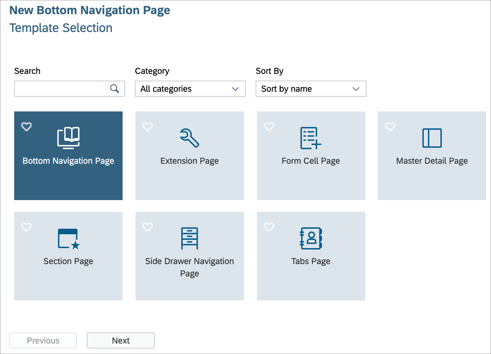
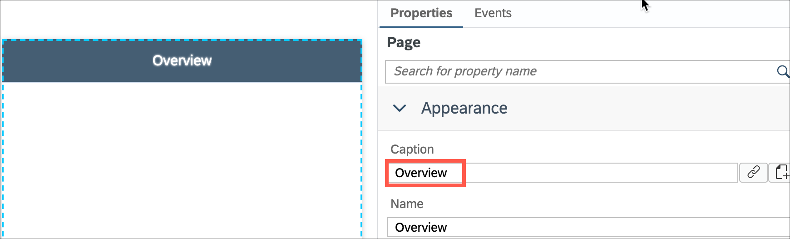
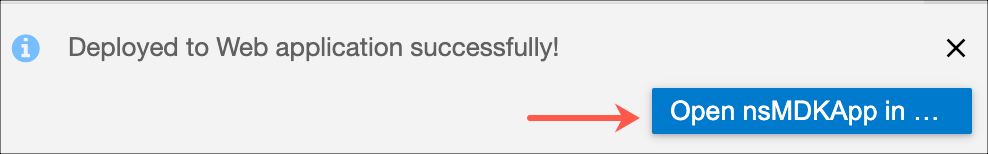

# Exercise 2 - Use Bottom Navigation for your application

In this exercise you will create a new page using Bottom Navigation page type and will add tab items to display the information.

- [Exercise 2.1 - Create a Bottom Navigation page](#exercise-21---create-a-bottom-navigation-page)
- [Exercise 2.2 - Add additional Tab items](#exercise-22---add-additional-tab-items)
- [Exercise 2.3 - Set the first page as the overview page](#exercise-23---set-the-first-page-as-the-overview-page)
- [Exercise 2.4 - Redeploy the application](#exercise-24---redeploy-the-application)
- [Exercise 2.5 - Update the MDK app with new metadata](#exercise-25---update-the-mdk-app-with-new-metadata)

### Exercise 2.1 - Create a Bottom Navigation page

Bottom Navigation is mainly used for top level navigation, treated as navigation menu, where the separate tabs don't have shared context.

1. In SAP Business Application Studio project, right-click the `Pages` | `MDK: New Page`.

    
   
2. Select `Bottom Navigation Page` and click `Next`.

    

3. Enter the `Page Name` as **Overview** and click `Next` and the `Finish` on the confirmation step.

    

   The geneated page has a default tab item. 

    

  You will update the page and default tab item properties.

4. When the bottom navigation control is loaded, it by default displays the content of the page bound to the first tab item, since there are already the `Caption` property (generated by the template) defined in the pages, we don't require the Caption in this page. Remove the `Caption` property as highlighted:

    

    Page layout should look like below:

    

5. Select the `TabItem0` and provide the below information in the Properties pane to display Customers list. 

    | Property | Value |
    |----|----|
    | `Caption`| Customers |
    | `Image`| sap-icon://customer |
    | `Name`| Customers |
    | `PageToOpen` | click the 3 icons, click *Object Browser* and bind to *Customers_List.page* |

      

    >Note: To display all the item properties in one view, click the highlighted icon. 
      

### Exercise 2.2 - Add additional Tab items
You will now add additional tab items to display other info.
1. Click the `+` icon and add 3 more tab items.    
    

    You should now have total 4 tab items.

    

2. Provide the below information for the second tab item in the Properties pane to display Products list:  

    | Property | Value |
    |----|----|
    | `Caption`| Products |
    | `Image`| sap-icon://product |
    | `Name`| Products |
    | `PageToOpen` | click the 3 icons, click *Object Browser* and bind to *Products_List.page* |

    

3. Provide the below information for the third tab item in the Properties pane to display Purchase Orders list: 

    | Property | Value |
    |----|----|
    | `Caption`| POs |
    | `Image`| sap-icon://my-sales-order  |
    | `Name`| POs |
    | `PageToOpen` | click the 3 icons, click *Object Browser* and bind to *PurchaseOrderHeaders_List.page* |

    

4. Provide the below information for the fourth tab item in the Properties pane to display Sales Orders list: 

    | Property | Value |
    |----|----|
    | `Caption`| Sales Orders |
    | `Image`| sap-icon://sales-order |
    | `Name`| SalesOrders |
    | `PageToOpen` | click the 3 icons, click *Object Browser* and bind to *SalesOrderHeaders_List.page* |

    

    The Overview page layout should look like below:

    

### Exercise 2.3 - Set the first page as the overview page

In the template generated project, there is already a page called *Main.page* which is also the page that opens after successful onboarding. For this exercise, you will change the default behavior of the app launch binding it to the *Overview page*.

1. Click the `Application.app` file, select the **Overview.page** for the `Main Page` property.

    

### Exercise 2.4 - Redeploy the application

1. Right-click the `Application.app` file in the project explorer pane, select `MDK:Deploy` and then select deploy target as **Mobile & Cloud**.

    
    

### Exercise 2.5 - Update the MDK app with new metadata

#### Mobile
1. Re-launch the app on your device, authenticate with passcode or Biometric authentication if asked. You will see a Confirmation pop-up, tap `OK`. 

1. You will now see the main page as the Overview page where you can navigate across tabs to see the page content.

  Android             |  iOS
:-------------------------:|:-------------------------:
  |  
  |  

#### Web

1. Either click the highlighted button or refresh the web page to load the changes.

    

    >Note 1: If you see the error *404 Not Found: Requested route (xxxxx-dev-nsdemosampleapp-approuter.cfapps.xxxx.hana.ondemand.com) does not exist.* while accessing the web application, make sure that in your space cockpit, highlight applications are in started state.
    

    >Note 2: If you see the error *Failed to initialize data service - Error 400 (Bad Request): GET/nsMDKApp/SampleServiceV2/?sap-language=en*, make sure that total user registrations shouldn't be more than 3 in the mobile app configuration. If so, delete one entry and refresh the page.

2.  You will now see the main page as the Overview page where you can navigate across tabs to see the page content.

    

## Summary

You've now changed your application to use a Bottom Navigation page to navigate within the application.

Continue to - [Exercise 3 - Create Customer Detail Tabs page with Address info and Order List](../ex3/README.md)