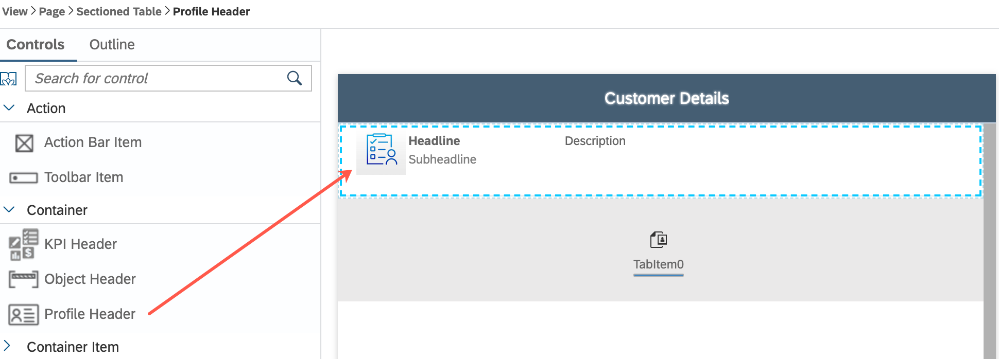
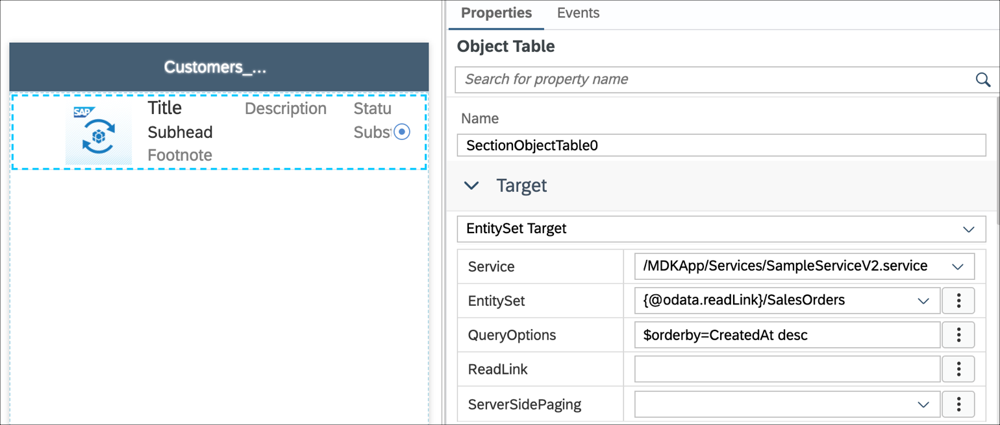

# Exercise 3 - Create Customer Detail Tabs page with Address info and Order List


In this exercise you will create a new page using Tabs page type and will add a profile header and tab items to display the customer specific information like Address and Sales Orders.

- [Exercise 3.1 - Create a Tab page](#exercise-31---create-a-tab-page)
- [Exercise 3.2 - Add a Profile Header](#exercise-32---add-a-profile-header)
- [Exercise 3.3 - Create a new page bound to the first tab item to display Customer Address](#exercise-33---create-a-new-page-bound-to-the-first-tab-item-to-display-customer-address)
- [Exercise 3.4 - Add an additional Tab item](#exercise-34---add-an-additional-tab-item)
- [Exercise 3.5 - Create a new page bound to the second tab item displaying Customer's Sales Orders](#exercise-35---create-a-new-page-bound-to-the-second-tab-item-displaying-customers-sales-orders)
- [Exercise 3.6 - Navigate from the Customer List to the Customer Tab page ](#exercise-36---navigate-from-the-customer-list-to-the-customer-tab-page)
- [Exercise 3.7 - Redeploy the application](#exercise-37---redeploy-the-application)
- [Exercise 3.8 - Update the MDK app with new metadata](#exercise-38---update-the-mdk-app-with-new-metadata)


### Exercise 3.1 - Create a Tab page

Tabs control allows you to have list of tab items where each tab item is bound to a related page.  You can use Tabs control to navigate between pages that are related and share same level of hierarchy.

Tabs pages also support displaying the header above the tabs so you can have a persistent header (Object, KPI and Profile).

1. In SAP Business Application Studio project, right-click the `Customers` | `MDK: New Page`.

    
   
2. Select `Tabs Page` and click `Next`.

    

3. Enter the `Page Name` as **Customers_tab** and click `Next` and the `Finish` on the confirmation step.

    

4. In the `Properties` pane set the `Caption` to **Customer Details**.

    

### Exercise 3.2 - Add a Profile Header

Next, you will add a `Profile Header` container to display information like first name, last name and will add activity items to make a trigger a phone call or open an email client.

1. In the Layout Editor, expand the `Controls` | `Container` section, drag and drop the `Profile Header` control onto the page area.

  

2. In the `Appearance` section of the Properties pane, bind the Profile Header properties with the Customers entity set properties.

    Provide the below information:

    | Property | Value |
    |----|----|
    | `Description` | Remove the default value and leave it blank |
    | `DetailImage` | Remove the default value and leave it blank |
    | `Headline` | **{FirstName} {LastName}** |
    | `Subheadline` | Remove the default value and leave it blank |

    

    In the `Data` | `ActivityItems` section of the Properties pane, click `+` icon to add a new activity item.

    

3. Click the `link icon` to open the Object browser for the `Phone` activity and bind it to the **PhoneNumber** property of the Customer entity.

    

4. Similarly, add one more activity item, select `Email` from the dropdown and bind it to **EmailAddress** property of the Customer entity. 
  You should now have total 2 activity items. 

    

### Exercise 3.3 - Create a new page bound to the first tab item to display Customer Address

You will update the default tab item properties and create a new page bound to this tab to display the Customer Address.

1. Select the tab item and provide the below information in the Properties pane to display Customers list. 

    | Property | Value |
    |----|----|
    | `Caption`| **Address** |
    | `Image` | **sap-icon://addresses** |
    | `Name` | **Address** |

    

 2. In `PageToOpen`, click the 3 icons, click `Create a page`.

    

3. In the `Select Folder` window, set the `Folders` path to **/MDKApp/Pages/Customers** and click `OK`. 

    

4. Select `Section Page` and click `Next`.

    

5. Enter the `Page Name` as **Customers_Address** and click `Next` and the `Finish` on the confirmation step.

    

6. The newly created `Customers_Address.page` will open automatically in the page editor. In the main area of the page, let's display some other details like: address, city, postal code, county, phone and email address.

    Drag and drop a `Static Key Value` container onto the page.

    

7. Expand the `Container Item` section of the Controls palette and drag and drop a `Key Value Item` onto the `Static Key Value` container on the page.

    

8. Provide the below information:

    | Property | Value |
    |----|----|
    | `KeyName`| **Address** |
    | `Value` | **{HouseNumber} {Street}** |    

    

9. Repeat the process and drag 5 more Key Value Items onto the `Static Key Value` section and bind those to other customer's properties as below:

    

10. Let's also display the address in a formatted way. 

    Drag and drop a `Static Key Value` container onto the page below the existing container. 

    

11. Update the `NumberOfColumns` to **1**. 

    

12. Expand the `Container Item` section of the Controls palette and drag and drop a `Key Value Item` onto the `Static Key Value` container on the page.

    

13. Provide the `KeyName` as **Formatted Address**. 

    

14. For the Formatterd Address's value, you will create a new rule and bind it to the value property. 
    Click the `Create a Rule` icon.

    

15. In the `Select Folder` window, select the **/MDKApp/Rules/Customers** folder to create a new rule and click `OK`.

        

16. Enter the Rule name **FormatAddress**, click `Next` and then `Finish` on the confirmation step.

      

17. The newly created rule file `FormatAddress.js` will open automatically in the rule editor. 

    Replace the generated snippet with below code and save the changes if not done automatically.

```JavaScript
// Helper function to return if the value passed into the function is empty
function isValEmpty(val) {
    return (val === undefined || val == null || val.length <= 0 || val === 'undefined');
}

export default function FormatAddress(context) {
	var addrBlock = '';

	// If the house number has a value include it in the address block
	if (!isValEmpty(context.binding.HouseNumber)) {
		addrBlock = addrBlock + context.binding.HouseNumber + ' ' + context.binding.Street;
	}

	// If at least one of (city, state or postal code) is populated add that to the address block
	if (!isValEmpty(context.binding.City) || !isValEmpty(context.binding.PostalCode)) {
		// Add a new line if there is something already in the address block	
		if (addrBlock.length > 0) {
			addrBlock = addrBlock + '\n'
		}
		// If the city has a value include it in the address block
		if (!isValEmpty(context.binding.City)) {
			addrBlock = addrBlock + context.binding.City;
		}
		// If the post caode has a value include it in the address block		
		if (!isValEmpty(context.binding.PostalCode)) {
			addrBlock = addrBlock + ", " + context.binding.PostalCode;
		}
	}
	
	// If the country has a value include it in the address block	
	if (!isValEmpty(context.binding.Country)) {
		// Add a new line if there is something already in the address block
		if (addrBlock.length > 0) {
			addrBlock = addrBlock + '\n'
		}
		addrBlock = addrBlock + context.binding.Country;
	}

	return addrBlock;
}
```

### Exercise 3.4 - Add an additional Tab item 

You will now add an additional tab item to display the customer's Sales orders.

1. Navigate to `Pages |Customers | Customers_tab.page`, select the `Tabs Control`, click `Add` to a new tab item. 

    

2. Provide the below information:  

    | Property | Value |
    |----|----|
    | `Caption`| **Sales Orders** |
    | `Image` | **sap-icon://sales-order** |
    | `Name` | **SalesOrders** |

    


 ### Exercise 3.5 - Create a new page bound to the second tab item displaying Customer's Sales Orders

1. In `PageToOpen` property for `item1`, click the 3 icons, click `Create a page`.

    

2. In the `Select Folder` window, set the `Folders` path to **/MDKApp/Pages/Customers** and click `OK`.

    

    >Note: Known Issue#1
  
3. Select `Section Page` and click `Next`.

    

4. Enter the `Page Name` **Customers_SalesOrders** and click `Next` and the `Finish` on the confirmation step.

    

5. The newly created page `Customers_SalesOrders.page` will open automatically in the page editor. In the page, add an `Object Table` compound to display information like sales order ID, order creation date, gross amount and life cycle status name.

    In the Layout Editor, expand the `Controls` | `Compound` section, drag and drop the `Object Table` control onto the page area.

    

6. In the `Properties` | `Target` pane, provide below information:

    | Property | Value |
    |----|----|
    | `Service`| Select **SampleServiceV2.service** from the dropdown |
    | `Entity` |Select **{@odata.readLink}/SalesOrders** from the dropdown |
    | `QueryOptions`| **$orderby=CreatedAt desc** |

    


    >The `odata.readLink` annotation contains the read URL of the entity or collection.

    > `SalesOrders` is a navigation property in Customer entity to `SalesOrderHeader` entity. You can find this information in OData service metadata document.

    >

    >`QueryOptions` expression will filter order entries returned in descending when sorted by the order creation date property.
    >

7. Now, start binding Object Table properties with `SalesOrderHeaders` entity set properties.

    In the `Appearance` section of the `Properties` pane, provide the below information:

    | Property | Value |
    |----|----|
    | `Description`| Remove the default value and leave it blank  |
    | `DetailImage`| Remove the default value and leave it blank  |
    | `Footnote` | **{SalesOrderId}**  |
    | `PreserveIconStackSpacing`| select **false** from the dropdown |
    | `ProgressIndicator` | Remove the default value and leave it blank  |
    | `Status`| **{LifeCycleStatusName}** |
    | `Subhead` | Remove the default value and leave it blank |
    | `Substatus`| **$(C,{GrossAmount},{CurrencyCode},'',{minimumIntegerDigits:1,minimumFractionDigits:2,maximumFractionDigits:2,useGrouping:true})** |
    | `Title`| **Order Date: $(D,{CreatedAt},'','',{format:'medium'})**  |

    

    >`$(C,{GrossAmount},{CurrencyCode},'',{maximumFractionDigits:2,useGrouping:true})` is an expression of how to format currency value, end result would be like €200.44. By default it will be formatted to the device's locale setting.  More details on Currency Formatter is available in [documentation](https://help.sap.com/doc/f53c64b93e5140918d676b927a3cd65b/Cloud/en-US/docs-en/guides/getting-started/mdk/development/property-binding/i18n-formatter.html#currency-formatter).

    >

    >`$(D,{CreatedAt},'','',{format:'medium'})` is an expression of how to format a date, end result would be like June 20, 2020. By default it will be formatted to the device's locale setting. More details on Date Formatter is available in [documentation](https://help.sap.com/doc/f53c64b93e5140918d676b927a3cd65b/Cloud/en-US/docs-en/guides/getting-started/mdk/development/property-binding/i18n-formatter.html#date-formatter).

    >

8. In the `EmptySection`, provide **No Customer Orders** for the `Caption` property.

    

9. You will link the Object Table to the `NavToSalesOrderHeaders_Detail.action` so that when you select a sales order, the `SalesOrderHeaders_Detail.page` will open. MDK automatically passes the selected sales order to the details page.

    Switch to the `Events` tab, select the Object Table, click the `3 dots icon` for the `OnPress` event to open the `Object Browser`, double-click the **NavToSalesOrderHeaders_Detail.action** and click `OK` to set it as the `OnPress` Action.

    


### Exercise 3.6 - Navigate from the Customer List to the Customer Tab page 

1. In the `NavToCustomer_Detail.action`, you will update the `PageToOpen` property of the navigation action to open the Customer tab page. 

1. Navigate to `Actions` | `Customers` | `NavToCustomer_Detail.action`,  update the `PageToOpen` property by selecting the **Customers_tab.page** from the dropdown.

  

### Exercise 3.7 - Redeploy the application

1. Right-click the `Application.app` file in the project explorer pane, select `MDK: Deploy` and then select deploy target as **Mobile & Cloud**.

    
    

### Exercise 3.8 - Update the MDK app with new metadata

#### Mobile
1. Re-launch the app on your device, authenticate with passcode or Biometric authentication if asked. You will see a Confirmation pop-up, tap **OK**. 

1. Tap on any record in the Customers tab, Overview page where you can navigate across tabs to see the page content.

  Android             |  iOS
:-------------------------:|:-------------------------:
  |  


#### Web

1. Either click the highlighted button or refresh the web page to load the changes.

    

    >Note 1: If you see the error `404 Not Found: Requested route (xxxxx-dev-nsdemosampleapp-approuter.cfapps.xxxx.hana.ondemand.com) does not exist.` while accessing the web application, make sure that in your space cockpit, highlight applications are in started state.
    

    >Note 2: If you see the error `Failed to initialize data service - Error 400 (Bad Request): GET/nsMDKApp/SampleServiceV2/?sap-language=en`, make sure that total user registrations shouldn't be more than 3 in the mobile app configuration. If so, delete one entry and refresh the page.

2. Click any record in the Customers tab, Overview page where you can navigate across tabs to see the page content.

  

## Summary

You've now created a Tabs page to show the Customer Address and Sales Orders replacing the default Customer Detail page.

Continue to - [Exercise 4 - Add Another tab item to Bottom Navigation page from second service](../ex4/README.md)