# Exercise 4 - Add Another tab item to the Bottom Navigation page from a second OData service

In this exercise you will add a second OData service to your application and create a new Tab page to display data from the new service.

- [Exercise 4.1 - Deploy the new service](#exercise-41---deploy-the-new-service)
- [Exercise 4.2 - Add a new BTP Destination](#exercise-42---add-a-new-btp-destination)
- [Exercise 4.3 - Add Destination in Mobile Services using BTP Destination](#exercise-43---add-destination-in-mobile-services-using-btp-destination)
- [Exercise 4.4 - Add second service to the MDK application](#exercise-44---add-second-service-to-the-mdk-application)
- [Exercise 4.5 - Create new Initialization Action](#exercise-45---create-new-initialization-action)
- [Exercise 4.6 - Add a new tab to the bottom navigation page](#exercise-46---add-a-new-tab-to-the-bottom-navigation-page)
- [Exercise 4.7 - Redeploy the application](#exercise-47---redeploy-the-application)
- [Exercise 4.8 - Update the MDK app with new metadata](#exercise-48---update-the-mdk-app-with-new-metadata)

### Exercise 4.1 - Deploy the new service

For this exercise, a second odata service has been pre-created.  The service runs as an in-memory service.  This means any changes to the service entities are stored only in-memory.  If you stop and restart the service, any changes will be lost and the service will reset back to the inital state.

The service has been provided as an `.mtar` file for easy deployment to your subaccount.  The service consists of two entity sets that are related to each other.

| Entity | Description |
|----|----|
| `RisksSet` | A list of possible risks |
| `MitigationsSet` | Mitigations for the risks.  A mitigtaion can apply to more than one risk |

1. Navigate to the `ex4` exercise folder in the Session repository.

1. Right click on the `techedService_1.0.0.mtar` file and select **Deploy MTA Archive**

    

1. After the deploy completes, the service will be listed in the BTP cockpit under Applications

    

    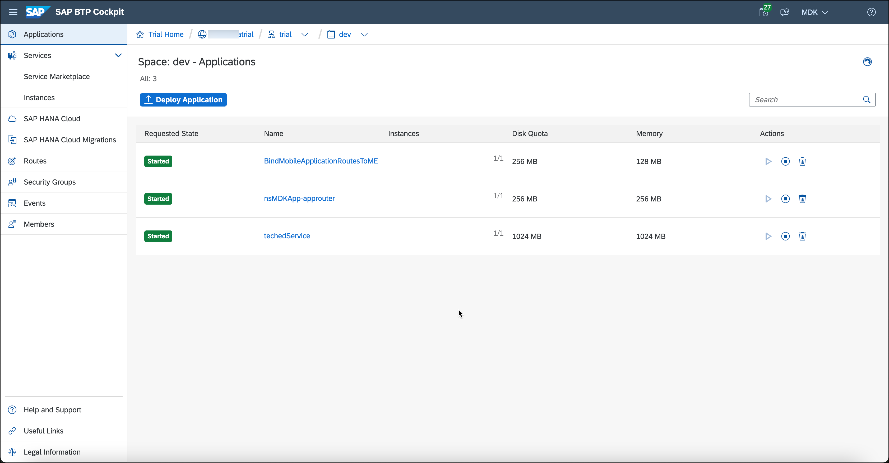

1. Click the `techedService` link on the Application list to view the service details and Application Route URL

    

1. Click the **Application Routes** link to verify the service is running.  It will open in a new browser tab, and display the service information.

    

1. Copy the URL from the new browser window for the TechEdService.  This will be used in the next step while setting up the BTP destination.

    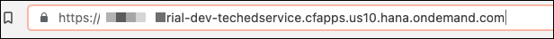

### Exercise 4.2 - Add a new BTP Destination

1. In Business Application Studio, navigate to the `ex4` exercise folder in the Session repository.

1. Right click on the `TechEdService.properties` destination template and select Download

    

1. Switch back to the BTP cockpit and navigate to the subaccount level

    

1. Select the Destinations menu item.  If not visible under Connectivity, first click the Connectity menu item to expand the sub-options.

    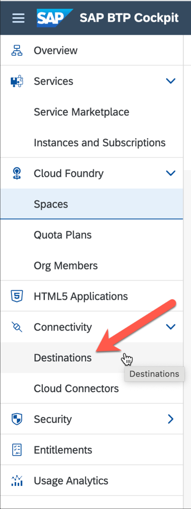

1. Click the Import button and select the `TechEdService.properties` destination downloaded from the Session repository

    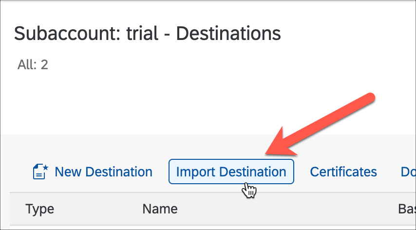

1. Paste the copied service URL into the **URL** field and click outside the URL field to clear the validation error.

    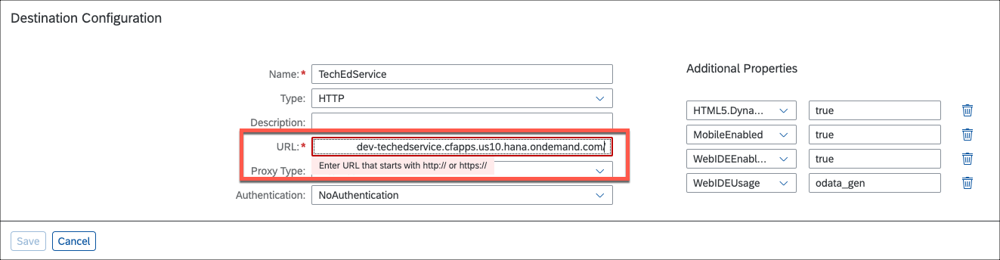

1. Check the `Use default JDK truststore` option and click **Save** to create the destination.

    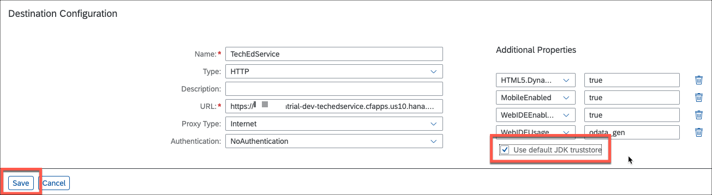

### Exercise 4.3 - Add Destination in Mobile Services using BTP Destination

1. Switch to the Mobile Services Cockpit.  If your Mobile Services session has timed out, click your login email to sign in again.

1. Navigate to the SAP MDK Demo App (com.sap.mdk.demo) and select `Mobile Connetivity` under Assigned Features.

    

1. Click the `Create` icon to add a new destination.

    

1. In **Basic Info** step, provide the required information and click **Next**.

    | Field | Value |
    |----|----|
    | `Destination Name` | TechEdService |
    | `SAP Destination Service` | Checked |
    | `Cloud Destination Name` | Select TechEdService from the popup list or type in the value |

    

    

1. For this tutorial, there are no Custom Headers, Annotations, or Destination Configuration setting required. Click **Next** to navigate through the steps and click **Finish**.

### Exercise 4.4 - Add second service to the MDK application

1. In Business Application Studio, right click on the MDKApp | Services folder and select **`MDK: New Service`**

    

1. In **Service Configuration** step, provide the required information and click **Check Service** to retrieve the metadata and if successful click **Next**

    | Field | Value |
    |----|----|
    | `Name` | TechEdService |
    | `Data Source` | Leave as default value `Mobile Services` |
    | `Destination` | Select the TechEdService from the drop down |

    

1. On the Confirmation step the metadata of the service will be displayed.  Click **Finish** to create the Service.

    

### Exercise 4.5 - Create new Initialization Action

1. Create a TechEdService folder Actions.  Right click on the Actions folder and select `New Folder` from the popup menu

    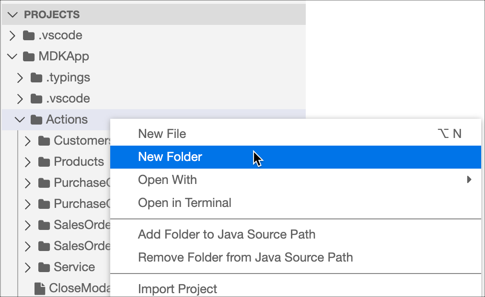

    

1. Create the Initialize action.  Right click on the new TechEdService folder and select `MDK: New Action`

    

1. On the **Template Selection** step, select `OData Action` and click Next

    

1. On the **Operation and Service Selection** steps, provide the required information and click **Next**

    | Field | Value |
    |----|----|
    | `Action Name` | Initialize |
    | `Type` | Select Initialize from the drop down |
    | `Service` | Select the TechEdService from the drop down |

    

1. On the next step, use the Plus button in the **Defining Requests** table header to add two rows to the table.  Provide the required information and click **Next** and **Finish**.

    | Row | Value |
    |----|----|
    | `Row 1 - Name & Query` | MitigationsSet |
    | `Row 2 - Name & Query` | RisksSet |

    

1. The new Initialize action editor will open.  Expand the `Common Action Properties` section and set the required information

    | Field | Value |
    |----|----|
    | `Action Result` | Set the value to `init` |
    | `Success Action` | Click the link icon and bind it to `Service` > `InitializeOfflineSuccessMessage.action` |
    | `Failure Action` | Click the link icon and bind it to `Service` > `InitializeOfflineFailureMessage.action` |
    | `Show Activity Indicator` | Select `true` from the drop down |
    | `Activity Indicator Text` | Set the value to `Downloading...` |

    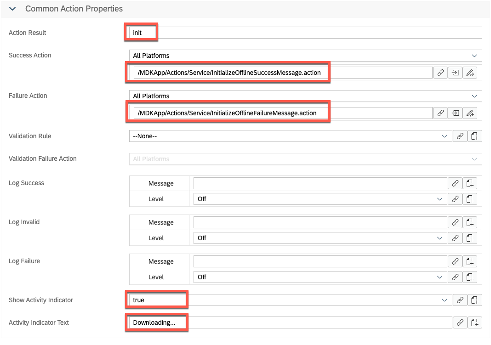

1. Chain the initialization actions together.  In the Explorer pane, expand and select the `Actions` | `Service` | `InitializeOffline.action` to open the action editor.

    

1. Expand the `Common Action Properties` section and change the Success Action to point to the `Initialize.action` just created.

    | Field | Value |
    |----|----|
    | `Success Action` | Click the link icon and bind it to `TechEdService` > `Initialize.action` |

    

### Exercise 4.6 - Add a new tab to the bottom navigation page

You will now add an additional tab item to display the list of Risks from the new service.

1. Navigate to `Pages` | `Overview.page`, select the `Bottom Navigation` Control and click the `+` icon and add one more tab item.

    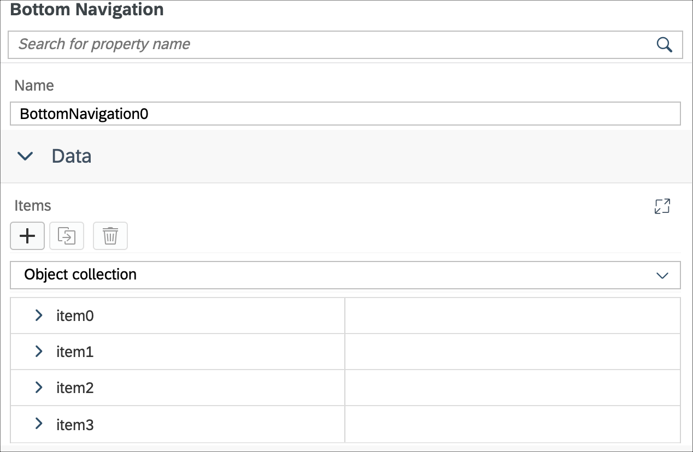

1. Provide the below information for `item4` in the Items section of the Properties pane to display the Risks list:  

    | Property | Value |
    |----|----|
    | `Caption`| **Risks** |
    | `Image` | **sap-icon://quality-issue** |
    | `Name` | **Risks** |

    

1. In `PageToOpen` property for `item4`, click the 3 icons, click `Create a page`.

    

1. In the `Select Folder` window click `OK`.

    

1. Select `Section Page` and click `Next`.

    

1. Enter the `Page Name` **Risks** and click `Next` and the `Finish` on the confirmation step.

    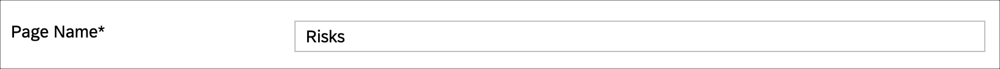

1. In the `Risks.page`, add an `Object Table` from the Compound group to display the Risk information.

    In the Layout Editor, expand the `Controls` | `Compound` section, drag and drop the `Object Table` control onto the page area.

    

1. In the `Properties` | `Target` pane, provide below information:

    | Property | Value |
    |----|----|
    | `Service`| Select **TechEdService.service** from the dropdown |
    | `EntitySet` | Select **RisksSet** from the dropdown |
    | `QueryOptions`| **$expand=Mitigation** |

    

    >`QueryOptions` expression will expand the Mitigation navigation properties so they are available to bind in the Object Cell.

    

1. Now, start binding Object Table properties with `RisksSet` properties.

    In the `Appearance` section of the `Properties` pane, provide the below information:

    | Property | Value |
    |----|----|
    | `Description`| Remove the default value and leave it blank  |
    | `DetailImage`| Remove the default value and leave it blank  |
    | `Footnote` | **{Mitigation/timeline} - {Mitigation/description}**  |
    | `PreserveIconStackSpacing`| select **false** from the dropdown |
    | `ProgressIndicator` | Remove the default value and leave it blank  |
    | `Status`| **{criticality}** |
    | `Subhead` | **{description}** |
    | `Substatus`| **$(C,{impact},'EUR','',{minimumIntegerDigits:1,minimumFractionDigits:2,maximumFractionDigits:2,useGrouping:true})** |
    | `Title`| **{title}**  |

    

    >`$(C,{impact},'EUR','',{maximumFractionDigits:2,useGrouping:true})` is an expression of how to format currency value, end result would be like €200.44. By default it will be formatted to the device's locale setting.  More details on Currency Formatter is available in [documentation](https://help.sap.com/doc/f53c64b93e5140918d676b927a3cd65b/Cloud/en-US/docs-en/guides/getting-started/mdk/development/property-binding/i18n-formatter.html#currency-formatter).

1. In the `EmptySection`, provide **No Risks** for the `Caption` property.

    

### Exercise 4.7 - Redeploy the application

1. Right-click the `Application.app` file in the project explorer pane, select `MDK: Deploy` and then select deploy target as **Mobile & Cloud**.

    
    

### Exercise 4.8 - Update the MDK app with new metadata

#### Mobile
1. Re-launch the app on your device, authenticate with passcode or Biometric authentication if asked. You will see a Confirmation pop-up, tap **OK**.

1. Tap on any record in the Risks tab, Overview page where you can navigate across tabs to see the page content.

    Android             |  iOS
    :-------------------------:|:-------------------------:
      |    

#### Web

1. Either click the highlighted button or refresh the web page to load the changes.

    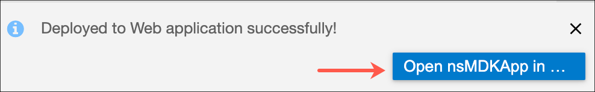

    >Note 1: If you see the error `404 Not Found: Requested route (xxxxx-dev-nsdemosampleapp-approuter.cfapps.xxxx.hana.ondemand.com) does not exist.` while accessing the web application, make sure that in your space cockpit, highlight applications are in started state.
      

    >Note 2: If you see the error `Failed to initialize application data service - Error: Error 0 (Unknown); GET https://webclient/TechEdService/`, make sure that total user registrations shouldn't be more than 3 in the mobile app configuration. If so, delete one entry and refresh the page.

1. Click the Risks bottom navigation tab to see the list of Risks from the new service.

    

## Summary

You've now added the second service to your application and displayed data from the service in your application.

Continue to - [Exercise 5 - Add a user menu to the application](../ex5/README.md)    
