# Exercise 5 - Add a user menu to the application

In this exercise we will add a User Menu to the Customer List page of the application.  Since the functions on the User Menu are generic in nature and can apply to almost any MDK application, the User Menu has been pre-created and will be added into the application as an MDK Component.

- [Exercise 5.1 - Copy the UserMenuComponent application into your workspace](#exercise-51---copy-the-usermenucomponent-application-into-your-workspace)
- [Exercise 5.2 - Update the Reference Applications](#exercise-52---update-the-reference-applications)
- [Exercise 5.3 - Create a CIM file for the User Menu Component](#exercise-53---create-a-cim-file-for-the-user-menu-component)
- [Exercise 5.4 - Configure the User Menu Component application](#exercise-54---configure-the-user-menu-component-application)
- [Exercise 5.5 - Set the Support Contact Information](#exercise-55---set-the-support-contact-information)
- [Exercise 5.6 - Add the User Menu button](#exercise-56---add-the-user-menu-button)
- [Exercise 5.7 - Redeploy the application](#exercise-57---redeploy-the-application)
- [Exercise 5.8 - Update the MDK app with new metadata](#exercise-58---update-the-mdk-app-with-new-metadata)

The User Menu contains the following items.

| Menu Option | Applies To | Description |
  |----|----|----|
  | `Sync` | Offline Applications running on iOS & Android Clients | This option is only applicable to offline applications.  If your application is an online application, you can set the visibility to false in the UserMenuPopover.action |
  | `Support` | All Clients | The Support option provides an easy way for users to contact support through the use of a contact cell.  The contact information is defined in globals.  The Activity Log option on the Support page allows the user to turn on/off client logging, set the log level, and if enabled in the Mobile Services application, also upload the current client logs. |
  | `Check for Updates` | Only applies to iOS & Andorid clients. |   This option will check if new Metadata has been deployed to Mobile Services App Update.  If new Metadata is found, it will be downloaded and prompt the user to apply the changes. |
  | `About` | All Clients | The About page displays the current user / device id along with the Application Name, Metadata version and Client version information |
  | `Reset` | All Clients | This option will completely reset the client.  This will erase any downloaded data and application Metadata and return the user to the Welcome screen. |
  | `Logout` | Multi-User iOS & Android Clients | This option will only appear if the client is configured to run in multi-user mode.  This option will exit to the sign in page but will not erase any downloaded data or application metadata |

### Exercise 5.1 - Copy the UserMenuComponent application into your workspace
Since the User Menu requires setting some configuration options, we will copy the component into our workspace

1. Exapand the session repository `teched2021-DEV162` | `exercises` | `ex5` folder
1. Select the UserMenuComponent folder and `Edit` | `Copy` from your browser menu (do not use the BAS context menu).

    

1. Collapse the project folders in the Explorer pane and right click below all the project folders in the empty space in the Explorer pane to clear any current selection.

    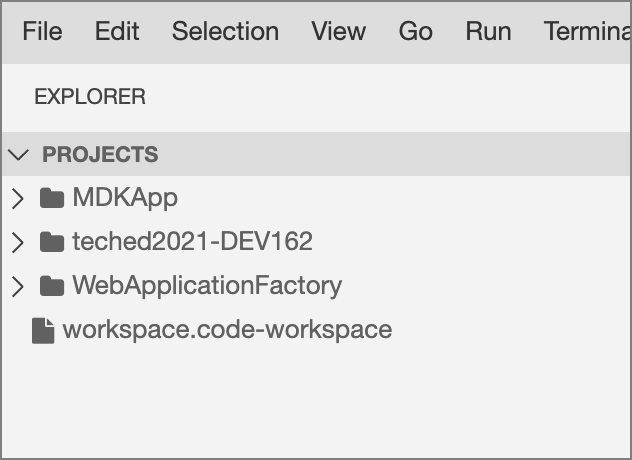
    >Note: None of the entries in the explorer are selected

1. Select `Edit` | `Paste` from your browser menu (not the BAS context menu) to paste the UserMenuComponent into the workspace as a new folder.

    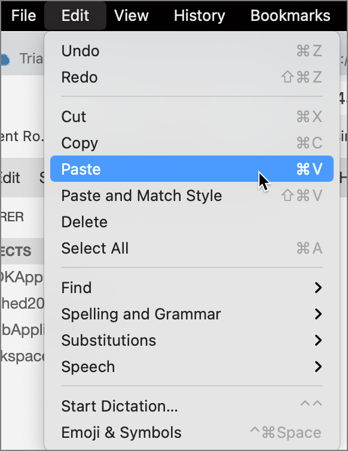

    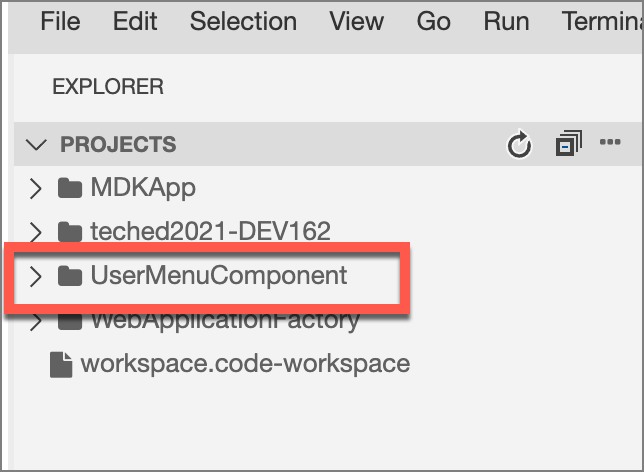

### Exercise 5.2 - Update the Reference Applications

When working with MDK Component applications, in order to validate entries and allow selection of objects from the component, the applications need a reference to the other application.

We will define the reference applications entry in both the `MDKApp` and `UserMenuComponent` application.  The setting has no effect at runtime on the client.

1. Expand the `UserMenuComponent` folder and select `Application.app` to open the MDK Application Editor

    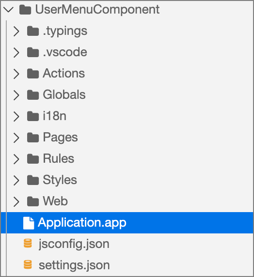

1. Scroll down to the Reference Applications section and click the Add button in the table header.

    
    
1. In the Object Browser, double-click on your MDK application project to set it in the Expression area and click `OK` to save the change.

    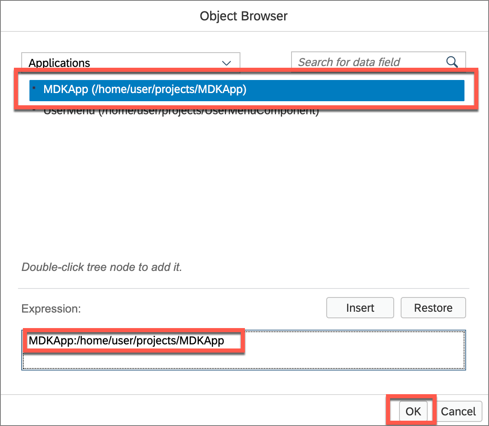

1. Close the Application.app editor window

    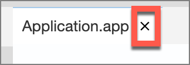

We will repeat this process in the MDKApp application as well.

1. Expand the `MDKApp` application folder and select the `Application.app` to open the MDK Application Editor

    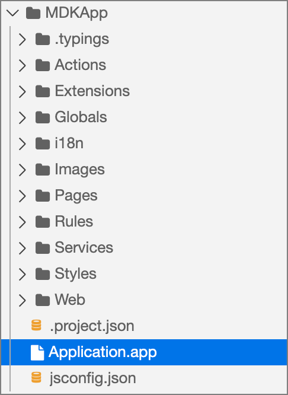

1. Scroll down to the Reference Applications section and click the Add button in the table header.

    

1. In the Object Browser, double-click on your MDK application project to set it in the Expression area and click `OK` to save the change.

    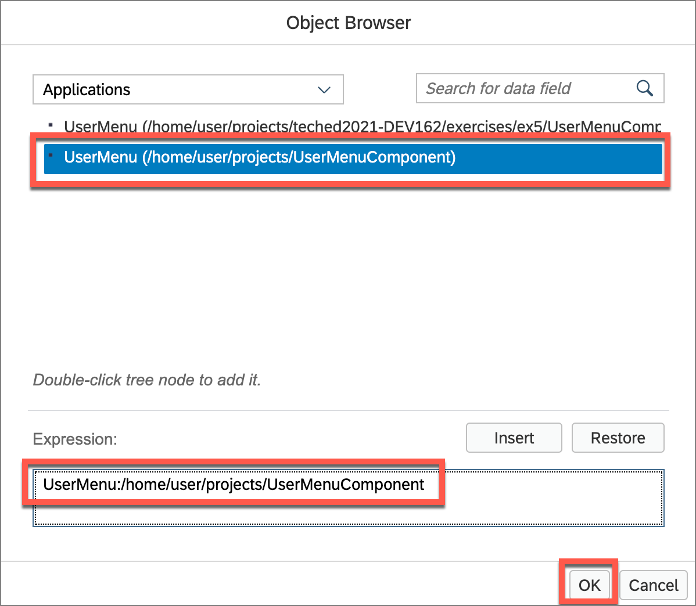

1. Close the Application.app editor window

    

### Exercise 5.3 - Create a CIM file for the User Menu Component

In order for the User Menu Component application to be included when deploying the `MDKApp` application, and to specify the overrides from the compoent application, a CIM file is needed the MDKApp application.

1. Right-click the `Application.app` file in the `MDKApp` project in the explorer pane and select `MDK: New CIM`

    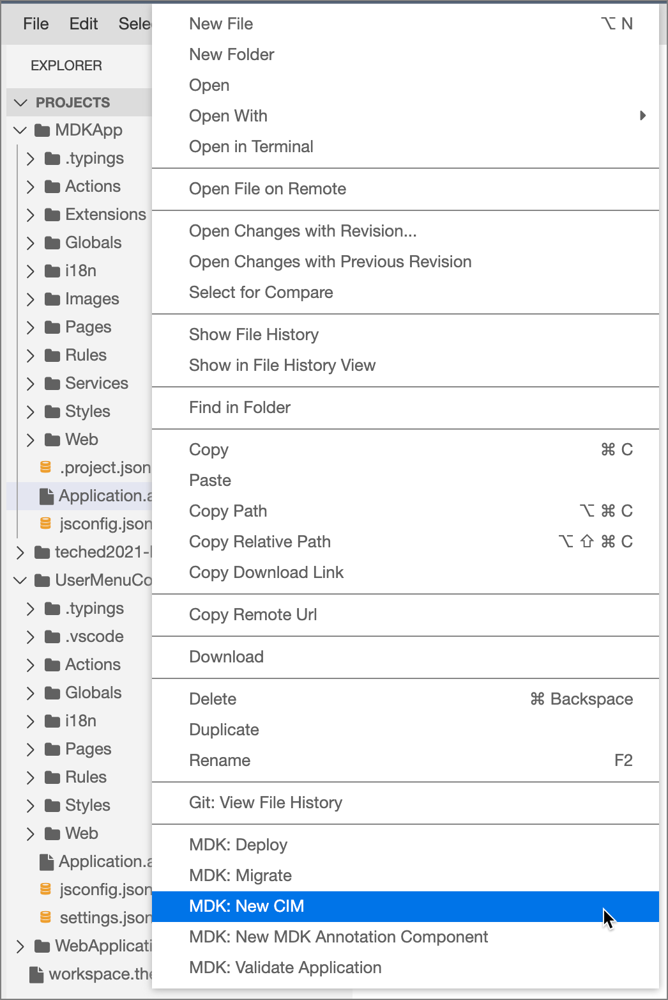

1. Wait for the Project Name field to display `--none--` and provide the required information and click **Next** and then click **Finish**.

    | Field | Value |
    |----|----|
    | `Project Name` | Select **UserMenuComponent** from the drop down |
    | `Application Name` | Select **UserMenu** from the drop down |
    | `CIM File Name` | Leave as the default value |

    

1. In the Integration Points table header click the `Add` button and select `Rule` from the menu

    

1. For the Source file, open the object browser and double click the `OnWillUpdate.js` from the `UserMenuComponent` to set it in the Expression and click `OK`

    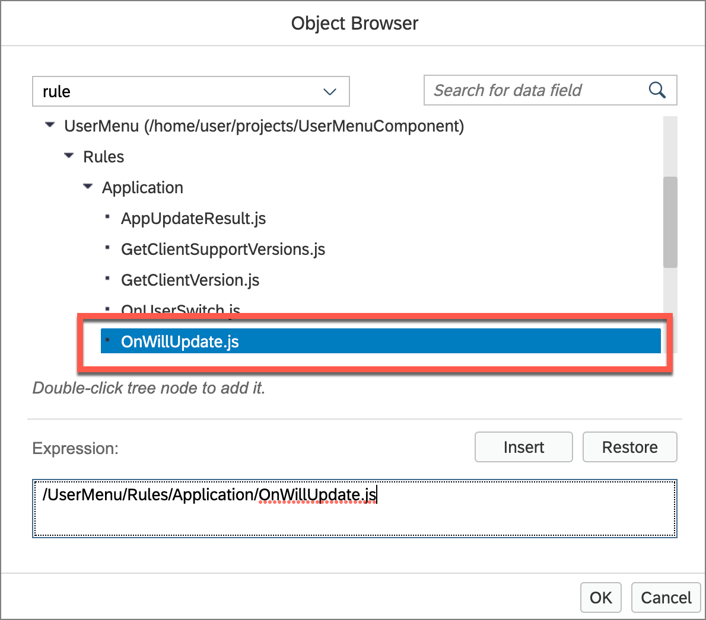

1. For the Target file, open the object browser and double click the `OnWillUpdate.js` from your MDKApp Application to set it in the Expression and click `OK`

    

1. Click the check button to create the integration point

    
    
    
    

### Exercise 5.4 - Configure the User Menu Component application

The User Menu Component has been designed to be used in different applications.  The component application needs to be configured for the specific application where it is being included.  All of the configuration options are set via globals in the UserMenuComponent application.

First, we will set the Application Name and Version

1. In the Explorer pane, expand the `UserMenuComponent` | `Globals` | `Application` folder

1. Select `ApplicationName.global` and edit the value to be the user friendly name of your application.

    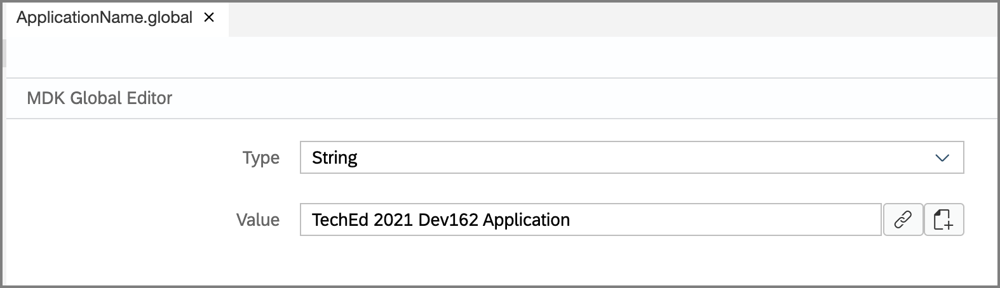

1. Select `AppDefinition_Version.global` and edit the version number for your application metadata (if desired)

    

Next, for the Sync menu option we need to point to the sync action from the MDKApp application.

1. In the Explorer pane, expand the `MDKApp` | `Pages` folder

    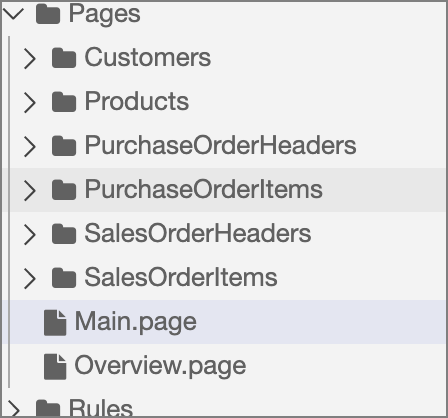

1. Select `Main.page` to open the MDK Layout Editor and select the Sync toolbar button

    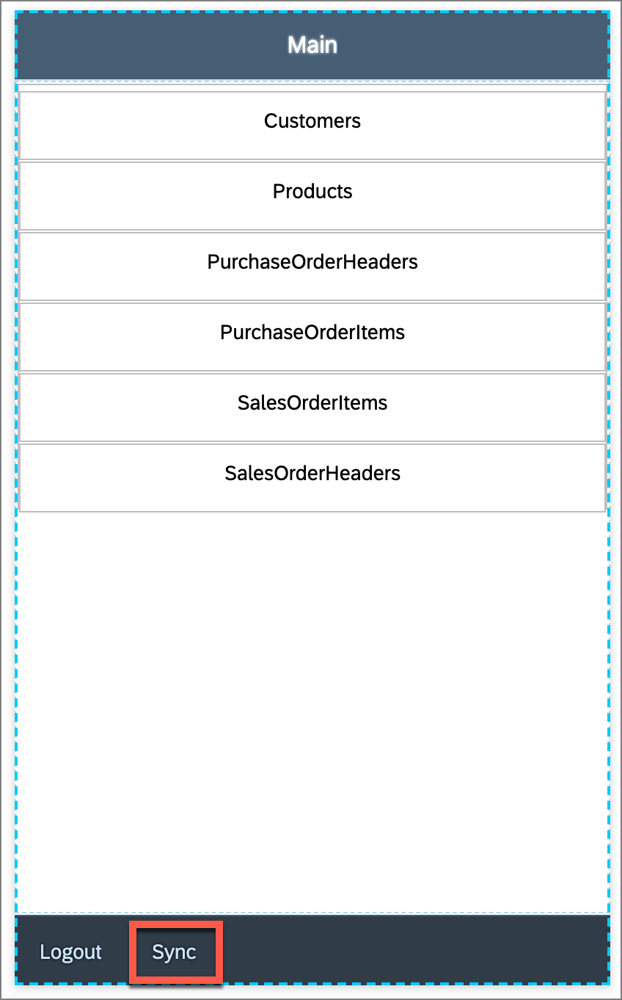

1. Select the **Events** tab and copy the OnPress action value

    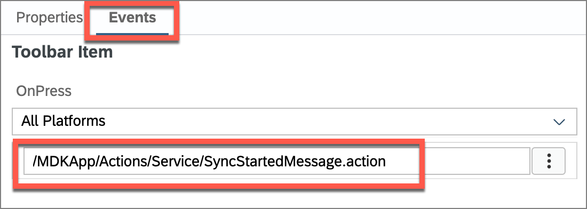

1. In the Explorer pane, expand the `UserMenuComponent` | `Globals` | `Application` folder and 

1. Select `SyncActionName.global` and paste the copied action name into the value field.

    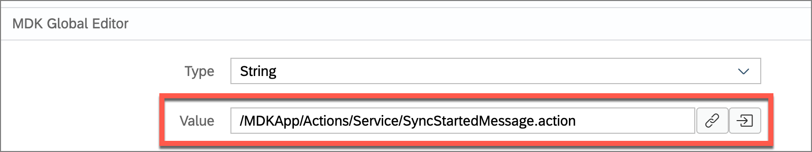

### Exercise 5.5 - Set the Support Contact Information

On the Support page, the user has options to contact support via phone, e-mail and facetime. 

1. Expand the `UserMenuComponent` | `Globals` | `Application` | `Support` folder

    

1. Select `UserSupportEmail.global` and set the Value to the e-mail address for user support inquiries.

    

1. Select `UserSupportPhone.global` and set the Value to the phone number for user support inquiries.

    

1. Select `UserSupportFaceTime.global` and set the phone number for user face time support inquiries.  This is only applicable for iOS devices.

            

### Exercise 5.6 - Add the User Menu button

The User Menu button next needs to be added to the `MDKApp`.

1. In the Explorer pane, expand the `MDKApp` | `Pages` | `Customers` folder

    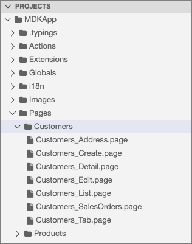

1. Select `Customers_List.page` to open the MDK Layout Editor

    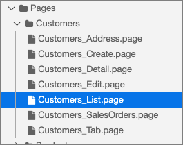

1. Drag and drop an `Action Bar Item` from the Controls pallette to the left side of the action bar for the Customers page.

    

1. Provide the below information for the Action Bar Item in the Properties pane to display the User Menu button: 

    | Property | Value |
    |----|----|
    | `Caption`| User Menu |
    | `Icon`| sap-icon://customer |
    | `Name`| UserMenu |

    

1. Switch to the `Events` tab, select the Object Table, click the `3 dots icon` for the `OnPress` event to open the `Object Browser`, sesarch for `usermenu` and then expand the UserMenu application.  Double-click the **UserMenuPopover.action** and click `OK` to set it as the `OnPress` Action.

    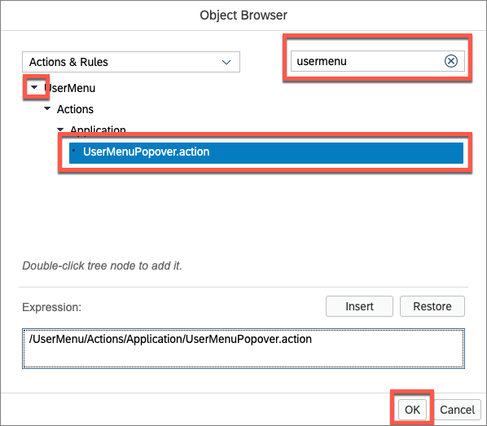

    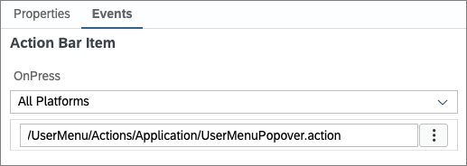

### Exercise 5.7 - Redeploy the application
1. Right-click the `MDKApp` | `Application.app` file in the project explorer pane, select `MDK:Deploy` and then select the deploy target as **Mobile & Cloud**.

    
    

### Exercise 5.8 - Update the MDK app with new metadata
#### Mobile
1. Re-launch the app on your device, authenticate with passcode or Biometric authentication if asked. You will see a Confirmation pop-up, tap `OK`.

1. You will now see that the Customer page now has the user menu button in the action bar.

    Android             |  iOS
    :-------------------------:|:-------------------------:
      |  

#### Web

1. Either click the highlighted button or refresh the web page to load the changes.

    

    >Note 1: If you see the error *404 Not Found: Requested route (xxxxx-dev-nsdemosampleapp-approuter.cfapps.xxxx.hana.ondemand.com) does not exist.* while accessing the web application, make sure that in your space cockpit, highlight applications are in started state.
    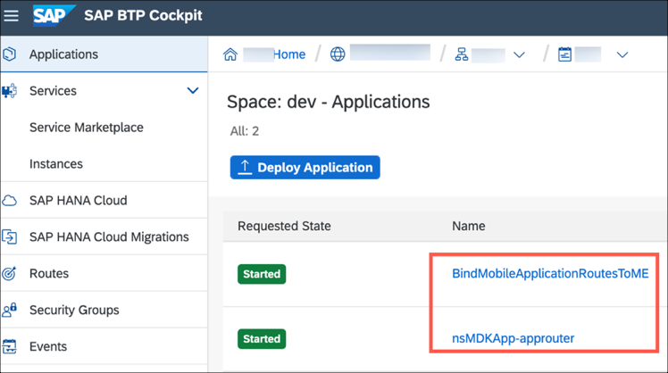

    >Note 2: If you see the error *Failed to initialize data service - Error 400 (Bad Request): GET/nsMDKApp/SampleServiceV2/?sap-language=en*, make sure that total user registrations shouldn't be more than 3 in the mobile app configuration. If so, delete one entry and refresh the page.

2.  You will now see the User Menu button on the Customers page.

    

## Summary

You've now added the User Menu MDK Component to your application.

Congratulations, you have completed the SAP TechEd 2021 session *DEV162 – Developing enterprise grade mobile apps and mobile experiences.*   